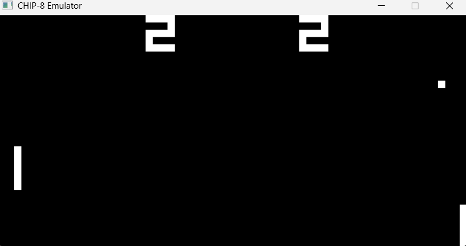
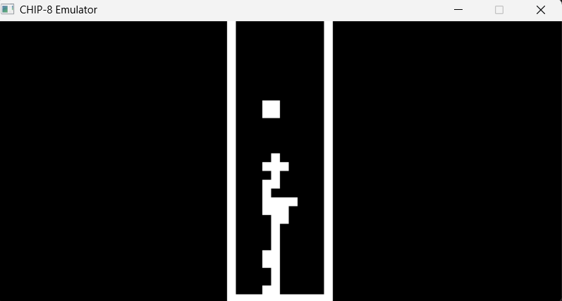

# CHIP-8 Emulator

CHIP-8 is an interpreted programming language developed in the 1970s for early 8-bit microcomputers. This project is a custom-built virtual machine that faithfully recreates that original hardware architecture, allowing classic retro games to be played on modern systems.


## Screenshots



**Pong**



**Tetris**

## System Specifications

* **Instruction Execution Rate:** ~660 Hz (Configurable)
* **Screen & Timer Refresh Rate:** 60 Hz 
* **Resolution:** 64x32 pixels (Dynamically scaled)

## Technical Requirements

If you are forking this project or building it from source, you will need the following installed on your system:
* **C++ Compiler:** Requires C++17 or newer (e.g., `g++` via MSYS2/MinGW on Windows).
* **SDL2 Library:** Used for rendering graphics and capturing hardware inputs.

## Building and Running

A build script is included for convenience. Run the following command in your bash terminal:
```bash
./build.sh
```

To play a game, run the executable and pass the ROM file as an argument:
```bash
./chip8.exe "games/Pong.ch8"
```